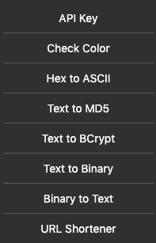

# Generators
Google Chrome extension for generate api key, shorten url, convert ascii to hex, text to binary and binary to text, check color hex and encrypt to MD5 and BCrypt.

<p align="center">
  
</p>

# Features
* Generate API Key
* Check Color
* Hex to ASCII
* Text to MD5
* Text to BCrypt
* Text to binary
* Binary to text
* Short URL

# Running
The application run locally, just package and use.

### 1. Run
```
# Open Google Chrome extensions
At the top right, turn on Developer mode.

# Load
Click Load unpacked.

# Select
Find and select the Generators folder.
```

### 2. Build
```
# Find the Generators folder
Zip the folder. Then, Publish it in the Chrome Web Store.
```

# Authors
* [xxgicoxx](https://github.com/xxgicoxx)

# Acknowledgments
* [FlatIcon](https://www.flaticon.com/)